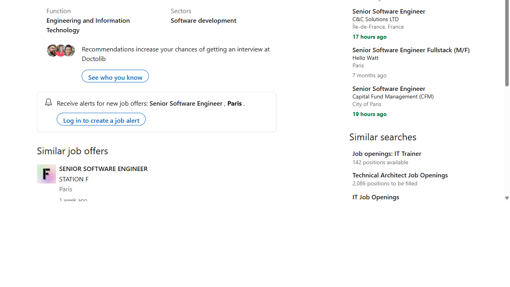

# 🤖 Job Agent — AI-Powered Job Application System

A full-stack Agentic AI system for automated job searching, resume tailoring, ATS scoring, and cover letter generation across multiple job platforms.
- 🧠 **AI-Powered** | Multi-Agent Pipeline | LangGraph Orchestrated
- 🌐 **Searches LinkedIn, Remotive, Internshala, Adzuna** simultaneously
- 📄 **Tailors your resume, audits 27 ATS parameters, and writes cover letters** automatically
---
## 📷 Project Screenshots
### 🖥️ Live Dashboard & Multi-Agent Workspace

---
## 📜 Table of Contents
- [About the Project](#-about-the-project)
- [Key Features](#-key-features)
- [Multi-Agent Architecture](#-multi-agent-architecture)
- [Project Directory Structure](#-project-directory-structure)
- [Prerequisites](#-prerequisites)
- [Local Installation & Setup](#-local-installation--setup)
- [Environment Variables (.env)](#-environment-variables-env)
- [Running the Web Dashboard](#-running-the-web-dashboard)
- [Viewing & Inspecting the SQLite Database](#-viewing--inspecting-the-sqlite-database)
- [Free Online Deployment (Vercel)](#-free-online-deployment-vercel)
- [License & Credits](#-license--credits)
---
## 🧠 About the Project
**Job Agent (CareerNexus)** is an autonomous, multi-agent AI application designed to streamline every phase of the job hunting process. Powered by **Llama 3.3 70B via Groq acceleration**, **FastAPI**, **LangGraph**, and **SQLite 3**, it transitions candidate resumes from raw PDF/DOCX documents to fully audited, job-tailored applications linked directly with recruiters and synced to Notion CRM workspaces.
