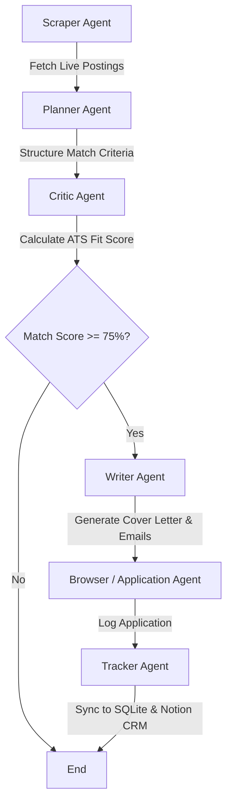

# 🤖 Job Agent — AI-Powered Job Application System


A full-stack Agentic AI system for automated job searching, resume tailoring, ATS scoring, and cover letter generation across multiple job platforms.

- 🧠 **AI-Powered** | Multi-Agent Pipeline | LangGraph Orchestrated
- 🌐 **Searches LinkedIn, Remotive, Internshala, Adzuna** simultaneously
- 📄 **Tailors your resume, audits 27 ATS parameters, and writes cover letters** automatically

---

## 📷 Project Screenshots

### 🖥️ Live Dashboard & Multi-Agent Workspace

https://career-nexus-sigma.vercel.app/  (live)


---

## 📜 Table of Contents

- [About the Project](#-about-the-project)
- [Key Features](#-key-features)
- [Multi-Agent Architecture](#-multi-agent-architecture)
- [Project Directory Structure](#-project-directory-structure)
- [Prerequisites](#-prerequisites)
- [Local Installation & Setup](#-local-installation--setup)
- [Environment Variables (.env)](#-environment-variables-env)
- [Running the Web Dashboard](#-running-the-web-dashboard)
- [Viewing & Inspecting the SQLite Database](#-viewing--inspecting-the-sqlite-database)
- [Free Online Deployment (Vercel)](#-free-online-deployment-vercel)
- [License & Credits](#-license--credits)

---

## 🧠 About the Project

**Job Agent (CareerNexus)** is an autonomous, multi-agent AI application designed to streamline every phase of the job hunting process. Powered by **Llama 3.3 70B via Groq acceleration**, **FastAPI**, **LangGraph**, and **SQLite 3**, it transitions candidate resumes from raw PDF/DOCX documents to fully audited, job-tailored applications linked directly with recruiters and synced to Notion CRM workspaces.

Rather than providing simple keyword counters or generic percentage ratings, Job Agent executes a **dual-pass evaluation pipeline**:
1. **Pass 1 (Parsability Audit)**: Verifies layout readability, section header compliance, font hierarchy, and date extraction against ATS systems like Greenhouse, Lever, Workday, and BambooHR.
2. **Pass 2 (Semantic Relevance)**: Grades quantifiable achievements, action verb strength, domain technical skills, and role alignment.

---

## ✨ Key Features

### 🎯 1. 27-Point Dual-Pass ATS Resume Scorer
- Evaluates resumes across 6 core assessment domains: **System Parsability**, **Content Quality**, **Recruiter Red Flags**, **Section Structure**, **Role Alignment**, and **Seniority & Bias**.
- Interactive **4-Point Audit Checklist** evaluating *Professional Experience*, *Technical Skill Mapping*, *Formatting & Layout*, and *Education Profile*.
- Uncovers missing hard/soft skills and generates color-coded AI bullet point rewrites.

### 💬 2. Real-Time Career AI Coach
- Interactive mentor with full semantic memory of your loaded resume and job descriptions.
- Practice behavioral STAR-format interview questions, technical system design prompts, and elevator pitches.

### 🏢 3. Corporate Intelligence Dossiers
- Deep-dive research across Wikipedia and public APIs to build employer reports.
- Extracts workforce headcount, revenue brackets, matching vs. missing tech stacks, corporate culture tags, main market competitors, and customized interview cheat sheets.

### 🚀 4. Multi-Agent Job Campaigns
- Automated job discovery across live job aggregators (LinkedIn, Remotive, Internshala, Adzuna).
- Automatically computes match scores, generates customized Cover Letters, drafts recruiter outreach emails, and formats LinkedIn connection notes.

### 📊 5. Native Notion CRM Synchronization
- Synchronizes saved application entries straight into personal Notion job boards with company names, job URLs, fit scores, and application dates.

### ✨ 6. High-Converting Landing Page & Spark Backdrop
- 4-page scrollable showcase with live drag & drop resume parser, simulated scanner preview, 27 AI checks matrix, 10 expandable FAQ accordions, and cursor particle spark animations.

---

## 🏗️ Multi-Agent Architecture



---

## 📁 Project Directory Structure

```text
job-agent/
├── api/
│   └── index.py            # Vercel serverless function entrypoint
├── agents/
│   ├── ats_agent.py        # 27-point ATS scoring engine
│   ├── browser.py          # Browser application automation
│   ├── chat_agent.py       # Llama 3.3 AI Career Coach
│   ├── company_agent.py    # Company intel & Wikipedia research
│   ├── critic.py           # Evaluation agent
│   ├── email_agent.py      # Recruiter outreach email generator
│   ├── planner.py          # Campaign planning agent
│   ├── scraper.py          # Job aggregator scraper
│   ├── tracker.py          # Application logger
│   └── writer.py           # Cover letter & resume tailoring agent
├── core/
│   ├── database.py         # SQLite 3 database manager & Vercel /tmp fallback
│   ├── graph.py            # LangGraph multi-agent workflow graph
│   ├── memory.py           # Memory state management
│   └── state.py            # TypedDict state definitions
├── data/
│   └── database.db         # Persistent SQLite database
├── static/
│   └── index.html          # Single Page Application frontend (HTML, Tailwind CSS, JS)
├── tools/
│   ├── browser_tools.py    # Web automation tools
│   └── llm.py              # Groq Llama-3.3 API integration helper
├── .env                    # Environment API Keys
├── main.py                 # CLI entrypoint
├── server.py               # FastAPI backend server
├── requirements.txt        # Python package dependencies
└── vercel.json             # Vercel serverless deployment config
```

---

## ⚙️ Prerequisites

- **Python**: Version 3.11 or higher
- **Groq API Key**: Free developer key from [console.groq.com](https://console.groq.com/)
- **Notion Integration Token**: *(Optional)* From [notion.so/my-integrations](https://www.notion.so/my-integrations)
- **Adzuna App Credentials**: *(Optional)* From [developer.adzuna.com](https://developer.adzuna.com/)

---

## 🛠️ Local Installation & Setup

1. **Clone the repository**:
   ```bash
   git clone https://github.com/your-username/job-agent.git
   cd job-agent
   ```

2. **Create and activate a virtual environment**:
   ```bash
   # Windows
   python -m venv venv
   venv\Scripts\activate

   # macOS / Linux
   python3 -m venv venv
   source venv/bin/activate
   ```

3. **Install dependencies**:
   ```bash
   pip install -r requirements.txt
   ```

---

## 🔑 Environment Variables (.env)

Create a `.env` file in the root directory and add your API credentials:

```env
GROQ_API_KEY=gsk_your_groq_api_key_here
NOTION_API_KEY=ntn_your_notion_integration_token_here
NOTION_DATABASE_ID=your_notion_database_id_here
ADZUNA_APP_ID=your_adzuna_app_id_here
ADZUNA_APP_KEY=your_adzuna_app_key_here
```

---

## 🚀 Running the Web Dashboard

Start the FastAPI development server using Uvicorn:

```bash
python -X utf8 -m uvicorn server:app --host 127.0.0.1 --port 8000 --reload
```

Open your browser and navigate to: **https://career-nexus-sigma.vercel.app/**

---

## 📊 Viewing & Inspecting the SQLite Database

All user accounts, uploaded resumes, and job application logs are stored in `data/database.db`.

### Option 1: Terminal Inspector Script
Run the built-in database viewer script:
```bash
python scratch/view_db.py
```

### Option 2: VS Code Extension
1. Install **SQLite Viewer** extension in VS Code.
2. Click on `data/database.db` in the file tree.

### Option 3: GUI Application
Download **[DB Browser for SQLite](https://sqlitebrowser.org/)** and open `data/database.db`.

---

## 🌐 Free Online Deployment (Vercel)

This repository includes full Vercel Serverless support out of the box (`vercel.json` & `api/index.py`).

### Deploy via GitHub:
1. Push your code to a GitHub repository.
2. Go to **[Vercel Dashboard](https://vercel.com/)** and click **New Project**.
3. Import your `job-agent` repository.
4. Add environment variables under **Environment Variables**:
   - `GROQ_API_KEY`
   - `NOTION_API_KEY`
   - `ADZUNA_APP_ID`
   - `ADZUNA_APP_KEY`
5. Click **Deploy**! Vercel will build and host your app on a free `https://job-agent.vercel.app` URL.

---

## 📄 License & Credits

- **License**: Apache 2.0
- **AI Model**: Meta Llama 3.3 70B Versatile (via Groq Cloud)
- **Framework**: FastAPI & LangGraph
